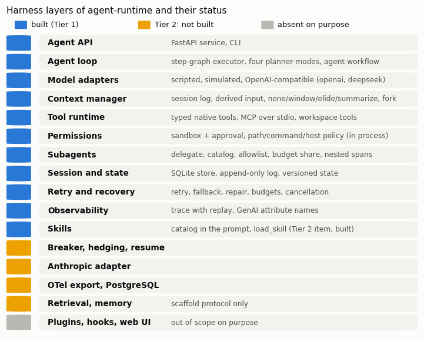
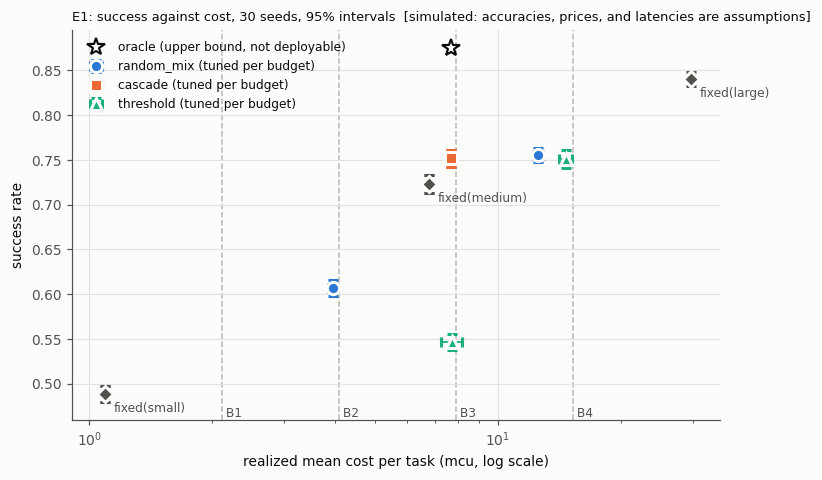
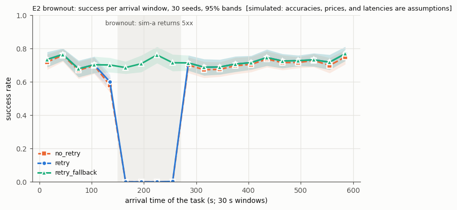
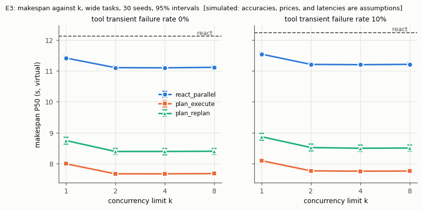

# agent-runtime

A small, deterministic, replayable agent runtime at the level of an agent harness: the layer between a model and its tools that owns the agent loop, the model's context (derived from a logged session), the tools and the permissions they run under, subagents, the sessions, tracing with replay, and exact token and cost accounting; its decision parts (routing under a cost budget, retry and fallback, planning, scheduling) are evaluated against simple baselines.

> **Simulated.** Every model in the evaluations is simulated: the accuracies, prices, and latencies are assumptions stated below, not measurements of any model, and the results say how the runtime and its decision rules behave under those assumptions and nothing about hosted models. No hosted model was called. The OpenAI-compatible adapter (dialects `openai` and `deepseek`) was tested only against a local stand-in server (a test double). Nothing here is presented as production-ready.

**Status:** Tier 1 complete and benchmarked in simulation (see [Results](#results-simulated)); of Tier 2, skills, the verifier study (E4b), the context study (E5), and the delegation study (E6) are built; the other Tier 2 items are listed under [TODO](#todo).



## What it is and what it is not

It is a runtime whose parts are explicit and measurable: typed model requests and responses with a closed error taxonomy, a typed tool registry (native tools, MCP servers over stdio, workspace tools), a permission layer in front of every tool call, a session log from which every model input is derived, a context manager with compaction, subagents, one trace per run with a replay that calls no provider and no tool, and an evaluation runner with paired statistics.

It is **not** an agent framework, not a LangChain replacement, and not a coding agent: the workspace tools exist so that the harness layers have something real to run and to guard, and no claim is made about how well any model works in them. **The permission layer is policy inside the process, not isolation by the operating system**: `run_command` can do whatever its command can do under the account that runs the service, the deny list of executable names guards against accidents and is not a security boundary, and a symbolic link swapped in between a path check and its use defeats the check.

| Harness layer | In this repository | Status |
|---|---|---|
| Agent loop | step-graph executor; planner modes `react`, `react_parallel`, `plan_execute`, `plan_replan`; the `agent` workflow | built |
| Model adapters | scripted, simulated, OpenAI-compatible (`openai`, `deepseek`) | built (Anthropic Messages: Tier 2, not built) |
| Context manager | session log, derivation of the input, policies `none`, `window`, `elide`, `summarize`, compaction events, fork | built |
| Tool runtime | typed native tools, MCP over stdio (mcp SDK 2.2.0), workspace tools (files, exec without shell, HTTP GET) | built |
| Skills | catalog in the prompt and `load_skill` (`examples/skills/`) | built (Tier 2 item) |
| Subagents | `delegate`, catalog, tool allowlist, budget share, nested spans | built |
| Session and state | SQLite store, versioned state, append-only log, restart persistence | built |
| Permissions | sandbox and approval modes, path, command, and host policy, approver | built (policy inside the process) |
| Retry and recovery | retry, fallback, repair, budgets, cancellation | built (resume, circuit breaker, hedging: Tier 2, not built) |
| Observability | trace with replay, GenAI attribute names | built (OpenTelemetry export: Tier 2, not built) |
| Agent API | FastAPI service, CLI | built |

More: [docs/harness.md](docs/harness.md) (layers and what was taken from the public design of DeepSeek's harness), [docs/architecture.md](docs/architecture.md), [docs/contracts.md](docs/contracts.md) (every format and rule), [docs/evaluation.md](docs/evaluation.md), [docs/optimization-agent.md](docs/optimization-agent.md).

## Quick start

Python 3.12. Create the environment once (it installs the package with all extras into `.venv` from PyPI):

```powershell
powershell -ExecutionPolicy Bypass -File scripts\setup_env.ps1
.venv\Scripts\python.exe -m pytest -q
```

```bash
bash scripts/setup_env.sh
source .venv/bin/activate
python -m pytest -q
```

(Git Bash on Windows: `source .venv/Scripts/activate`.) The published repository does not keep executable bits: on Linux and macOS run the scripts through `bash` as shown, or `chmod +x scripts/*.sh` once. Then, with the environment's Python (`.venv\Scripts\python.exe` in PowerShell, `python` in an activated bash):

```bash
python -m agent_runtime eval --quick
python scripts/demo.py
python examples/agent/run_agent.py
python -m agent_runtime run react --seed 1
python -m agent_runtime gen -n 2
python -m agent_runtime serve --port 18500
```

- `eval --quick`: E1-E3 with 3 seeds and 100 tasks each, one budget level of E1, and E4a (about half a minute here; results under `results/quick/`).
- `scripts/demo.py`: starts the stand-in provider and the service on 127.0.0.1 (ports 18510 and 18500, both recorded by PID), runs a chat session across two runs through the OpenAI-compatible adapter, a `react` run on the simulated models, an `optimize` run, and an `agent` run in a session workspace (it writes, reads, and edits a file, runs a harmless command, is denied a write outside the workspace, and delegates a lookup to a child agent), forks the session, reads a trace, replays a run, prints `/v1/usage`, and stops both processes by PID.
- `examples/agent/run_agent.py`: the same scripted agent without the service, in a temporary workspace, followed by a replay of its trace.
- `serve`: the HTTP API (`--time-scale`, `--max-sandbox`, `--max-approval`, `--allow-exec '["python", "-c"]'`, `--allow-hosts`, `--openai-base-url`); endpoints in [docs/contracts.md](docs/contracts.md) section 12 and [docs/openapi.json](docs/openapi.json).

The owner can run `python scripts/live_smoke.py` against an OpenAI-compatible endpoint configured through `AGENT_RUNTIME_LIVE_BASE_URL`, `AGENT_RUNTIME_LIVE_API_KEY`, and `AGENT_RUNTIME_LIVE_MODELS`; it prints `not run: no endpoint configured` otherwise.

## Routers and planner modes

- Routers: `fixed(m)` (with a fallback list), `random_mix` (a fixed probability per model, one draw per task), `cascade` (run the task on the first model of a chain; when the verifier rejects the answer or the run fails, run it again on the next one, unless that attempt cannot finish before the deadline at the model's median latency), `threshold` (two thresholds on the difficulty hint), and the offline `oracle` (an upper bound for routing that picks one model per task; it cannot be implemented). A router sees only the step kind, the candidates and their public prices, windows, and median latencies, the budget state, the finished attempts of the task (what the runtime knew), and the noisy difficulty hint: never the true tier and never an outcome that has not happened (a test checks this).
- Planner modes: `react` (one tool call or the final answer per turn), `react_parallel` (all calls whose dependencies are done, together under the concurrency limit), `plan_execute` (one planning call, list-scheduled steps, one answer call), `plan_replan` (as `plan_execute`; a failed step triggers a replanning call, at most 2, that never repeats a completed step); for E6 only, `delegate_plan` (one planning call, each independent branch of the plan run by a child agent, the plan's tail (the join and the steps after it) run by the parent without retry, one answer call). In the simulation the modes share their per-step accuracy, so they differ in calls, latency, cost, and recovery, not in planning quality.

## Assumptions of the simulation

| Model | Price in / out (cu per 1M tokens) | Latency (ms) | P(correct call) easy / medium / hard | Context (tokens) |
|---|---|---|---|---|
| `small` | 0.15 / 0.60 | 200 + 8 per output token | 0.92 / 0.55 / 0.15 | 4096 |
| `medium` | 1.00 / 4.00 | 500 + 15 per output token | 0.98 / 0.85 / 0.50 | 16384 |
| `large` | 5.00 / 20.00 | 1200 + 30 per output token | 0.995 / 0.96 / 0.82 | 32768 |

Latency times a lognormal factor (median 1, sigma 0.2). Prompt tokens: 500 plus 250 per tool result in the input (20 per stub, 100 per summary); completion tokens: 80 per tool call, 60 + 40 per plan step, 100 per summary, 120 per final answer. A wrong call is invalid (30%), names a missing entity (30%), or is silently wrong (40%); a run with a silent error ends with a wrong answer that only the verifier (recall 0.7, never rejecting a right answer) can catch. The difficulty hint is the tier plus Gaussian noise (sigma 0.6). Cost units (cu) are an abstract currency; the prices are illustrative and are not any provider's. The tasks (lookups, joins, and aggregates over a seeded world of customers, products, and orders, 20% followed by a report write) are far simpler than real agent tasks; they exist to exercise and measure the runtime. Full list: [docs/contracts.md](docs/contracts.md) section 10.

## Results (simulated)

All numbers below come from one run of `python -m agent_runtime eval --full --workers 8` on commit `5240bef`, with the E1 budget levels and the E1 and E5 selections frozen from the earlier tuning runs (the manifests with the commit, the configuration hash, the seeds, and the library versions are in `results/*/manifest.json` and `manifest_tuning.json`; later code changes, to the report, the manifest, and the API, touch no experiment). Every number is **simulated**: means over the 30 evaluation seeds 101-130 with 95% Student-t intervals (seeds 101-110 for the sensitivity runs), true in this simulation and under these assumptions only. Complete tables: [results/tables.md](results/tables.md). W/T/L counts seeds by the dominance rule of [docs/evaluation.md](docs/evaluation.md): a win is better on the primary metric beyond its band and not worse on a guard; a trade-off (better on the primary, worse on a guard) is a tie. Machine: Intel Core i9-14900KF, 32 logical processors, 96 GB, Windows 11, Python 3.12.3; 8 workers. The load note in the manifests is written by hand: no other agent run active, CPU load from the owner's jobs 22% (sampled for 10 s before the run). The whole run took 1837 s, of which the experiments' own wall times are 1825 s (wall-clock figures describe this machine only and are never compared).

### E1 routing under a cost budget



In the figure, the `random_mix` selections at B1 (all `small`) and B3 (all `medium`) lie under the `fixed(small)` and `fixed(medium)` markers, and the cascade selected at B3 and at B4 is the same configuration (one marker); the table lists every selection.

| Router | Budget B (mcu) | Configuration | Success | Cost (mcu) | P95 latency (s) | Escalations | Over 1.05 B | Δ success vs random_mix | W/T/L vs random_mix |
|---|---|---|---|---|---|---|---|---|---|
| fixed_small | - | `fixed_small` | 0.489 ± 0.009 | 1.09 ± 0.02 | 10.59 ± 0.16 | 0.000 ± 0.000 |  |  |  |
| fixed_medium | - | `fixed_medium` | 0.723 ± 0.010 | 6.78 ± 0.11 | 19.31 ± 0.31 | 0.000 ± 0.000 |  |  |  |
| fixed_large | - | `fixed_large` | 0.841 ± 0.008 | 29.68 ± 0.39 | 32.24 ± 0.14 | 0.000 ± 0.000 |  |  |  |
| oracle (upper bound, not deployable) | - | `oracle` | 0.875 ± 0.007 | 7.69 ± 0.33 | 24.40 ± 0.72 | 0.000 ± 0.000 |  |  |  |
| random_mix | B1 = 2.11 | `mix_1.00_0.00_0.00` | 0.489 ± 0.009 | 1.09 ± 0.02 | 10.59 ± 0.18 | 0.000 ± 0.000 | 0 |  |  |
| cascade | B1 = 2.11 | none within B on the tuning seeds | | | | | | | |
| threshold | B1 = 2.11 | none within B on the tuning seeds | | | | | | | |
| random_mix | B2 = 4.08 | `mix_0.50_0.50_0.00` | 0.607 ± 0.009 | 3.95 ± 0.12 | 16.44 ± 0.46 | 0.000 ± 0.000 | 0 |  |  |
| cascade | B2 = 4.08 | none within B on the tuning seeds | | | | | | | |
| threshold | B2 = 4.08 | none within B on the tuning seeds | | | | | | | |
| random_mix | B3 = 7.89 | `mix_0.00_1.00_0.00` | 0.723 ± 0.010 | 6.78 ± 0.11 | 19.27 ± 0.31 | 0.000 ± 0.000 | 0 |  |  |
| cascade | B3 = 7.89 | `cascade_m-l` | 0.752 ± 0.009 | 7.69 ± 0.15 | 21.76 ± 0.46 | 0.036 ± 0.004 | 0 | 0.028 ± 0.003 | 0/29/1 |
| threshold | B3 = 7.89 | `thr_2.5_3.0` | 0.546 ± 0.009 | 7.71 ± 0.46 | 29.82 ± 0.77 | 0.000 ± 0.000 | 0 | -0.177 ± 0.010 | 0/0/30 |
| random_mix | B4 = 15.29 | `mix_0.00_0.75_0.25` | 0.755 ± 0.008 | 12.54 ± 0.33 | 25.72 ± 0.62 | 0.000 ± 0.000 | 0 |  |  |
| cascade | B4 = 15.29 | `cascade_m-l` | 0.752 ± 0.009 | 7.69 ± 0.15 | 21.76 ± 0.46 | 0.036 ± 0.004 | 0 | -0.004 ± 0.004 | 4/17/9 |
| threshold | B4 = 15.29 | `thr_0.5_2.5` | 0.751 ± 0.010 | 14.69 ± 0.54 | 31.81 ± 0.20 | 0.000 ± 0.000 | 0 | -0.004 ± 0.006 | 1/5/24 |

- The fixed models span the range the routers work in: `small` 0.489 success at 1.09 mcu per task, `medium` 0.723 at 6.78, `large` 0.841 at 29.68; the offline oracle (cheapest successful fixed model per task: an upper bound for routing that picks one model per task, which cannot be implemented; a cascade's second attempt is a new draw, so it can succeed where every fixed model failed) reaches 0.875 at 7.69.
- At B1 and B2 only `random_mix` has a configuration within budget on the tuning seeds (`threshold` sends every hint at or above t2 <= 3.0 to `large`; a cascade starting at `small` costs more than B2), so nothing is ranked there.
- At B3 the cascade medium -> large is 0.028 (± 0.003) more successful than the best random mix (all `medium`), for 14% more cost (7.69 vs 6.78 mcu); under the dominance rule that trade-off is a tie on 29 of 30 seeds and a loss on 1. `threshold` loses to random mixing on every seed (0.546).
- At B4 the same cascade matches the best random mix (75% `medium`, 25% `large`) in success (difference -0.004 ± 0.004) at 39% less cost (7.69 vs 12.54 mcu); success is the primary metric, so this counts 4 wins, 17 ties, 9 losses. B4 did not separate the routers on the tuning seeds (informativeness check), so it is not ranked.
- Sensitivity (re-tuned per variant, at the same absolute B3, which with 50% hard tasks is below the cost of `fixed(medium)`): the cascade medium -> large stays 0.022-0.035 above the best random mix (all `medium`) under verifier recall 0.5 and 0.9 and hint noise 0.3 and 1.2 (it does not read the hint), a tie on 9 or 10 of 10 seeds; with 50% hard tasks instead of 15% the re-tuned cascade small -> medium -> large is 0.021 (± 0.012) above a 50/50 small/medium mix (1/6/3). `threshold` stays below random mixing or has no configuration within budget.
- In this simulation, at B3 (the only ranked level) the cascade buys 0.028 success for 14% more cost, a tie under the dominance rule, and the threshold router loses to random mixing on every seed. At B4, which is not ranked, the cascade costs 39% less with success within -0.004 ± 0.004, and the threshold router wins 1, ties 5, and loses 24 seeds.

### E2 reliability under provider faults



| Profile | Configuration | Success | P95 latency (s) | Cost (mcu) | Provider calls / task | Wasted calls / task | Δ success vs retry | W/T/L vs retry |
|---|---|---|---|---|---|---|---|---|
| calm | no_retry | 0.711 ± 0.010 | 19.22 ± 0.34 | 6.65 ± 0.12 | 4.53 ± 0.05 | 0.02 ± 0.00 | -0.013 ± 0.002 | 0/8/22 |
| calm | retry | 0.723 ± 0.010 | 19.31 ± 0.32 | 6.78 ± 0.11 | 4.60 ± 0.05 | 0.02 ± 0.00 | (reference) |  |
| calm | retry_fallback | 0.723 ± 0.010 | 19.31 ± 0.32 | 6.78 ± 0.11 | 4.60 ± 0.05 | 0.02 ± 0.00 | 0.000 ± 0.000 | 0/30/0 |
| flaky | no_retry | 0.484 ± 0.010 | 16.72 ± 0.23 | 4.26 ± 0.06 | 3.56 ± 0.03 | 0.39 ± 0.01 | -0.235 ± 0.010 | 0/0/30 |
| flaky | retry | 0.720 ± 0.010 | 23.43 ± 0.44 | 6.73 ± 0.11 | 5.12 ± 0.06 | 0.57 ± 0.02 | (reference) |  |
| flaky | retry_fallback | 0.723 ± 0.010 | 23.57 ± 0.50 | 6.78 ± 0.11 | 5.14 ± 0.07 | 0.56 ± 0.02 | 0.004 ± 0.001 | 2/14/14 |
| brownout | no_retry | 0.565 ± 0.012 | 18.18 ± 0.36 | 5.24 ± 0.10 | 3.80 ± 0.05 | 0.23 ± 0.01 | -0.010 ± 0.002 | 0/17/13 |
| brownout | retry | 0.575 ± 0.013 | 18.34 ± 0.36 | 5.37 ± 0.11 | 4.29 ± 0.04 | 0.64 ± 0.03 | (reference) |  |
| brownout | retry_fallback | 0.723 ± 0.010 | 20.72 ± 0.38 | 6.74 ± 0.11 | 7.25 ± 0.14 | 2.68 ± 0.12 | 0.148 ± 0.009 | 0/30/0 |

- Under `flaky`, retries recover most of the loss: success 0.720 with retries against 0.484 without (+0.235 ± 0.010), at a P95 latency of 23.4 s instead of 16.7 s and 0.57 wasted calls per task.
- Under `brownout`, retries alone barely help (0.575 vs 0.565): every `sim-a` call that starts between 150 s and 270 s fails. Only fallback to `sim-b` keeps tasks succeeding (0.723, +0.148 ± 0.009 over `retry`), at 2.68 wasted calls per task; without fallback almost no task that arrives in that interval succeeds (0 to 0.002 per 30 s window).
- Under `calm`, retries add 0.013 success; fallback is never used.

### E3 planning and scheduling



| Tool failures | Mode | k | Success | Makespan P50 (s) | Makespan P95 (s) | Model calls | Cost (mcu) | bound_gap | Duplicate writes | Replans | Δ P50 vs react (s) | W/T/L vs react |
|---|---|---|---|---|---|---|---|---|---|---|---|---|
| 0% | react | - | 0.550 ± 0.012 | 12.13 ± 0.06 | 23.17 ± 0.51 | 6.66 ± 0.05 | 10.92 ± 0.16 |  | 0 | 0.000 ± 0.000 | (reference) |  |
| 0% | react_parallel | 2 | 0.540 ± 0.011 | 11.11 ± 0.06 | 19.79 ± 0.37 | 4.83 ± 0.02 | 8.70 ± 0.08 |  | 0 | 0.000 ± 0.000 | -1.02 ± 0.07 | 14/16/0 |
| 0% | plan_execute | 2 | 0.436 ± 0.010 | 7.67 ± 0.06 | 18.61 ± 0.42 | 2.29 ± 0.01 | 4.11 ± 0.02 | 1.007 ± 0.001 | 0 | 0.000 ± 0.000 | -4.46 ± 0.08 | 0/30/0 |
| 0% | plan_replan | 2 | 0.540 ± 0.010 | 8.39 ± 0.09 | 22.54 ± 0.67 | 2.65 ± 0.02 | 5.06 ± 0.05 | 2.258 ± 0.059 | 0 | 0.277 ± 0.010 | -3.74 ± 0.09 | 12/18/0 |
| 10% | react | - | 0.550 ± 0.012 | 12.24 ± 0.06 | 23.37 ± 0.52 | 6.67 ± 0.05 | 10.94 ± 0.16 |  | 0 | 0.000 ± 0.000 | (reference) |  |
| 10% | react_parallel | 2 | 0.539 ± 0.011 | 11.21 ± 0.07 | 19.97 ± 0.34 | 4.83 ± 0.02 | 8.71 ± 0.08 |  | 0 | 0.000 ± 0.000 | -1.03 ± 0.06 | 14/16/0 |
| 10% | plan_execute | 2 | 0.434 ± 0.010 | 7.76 ± 0.06 | 18.67 ± 0.41 | 2.29 ± 0.01 | 4.10 ± 0.02 | 1.007 ± 0.001 | 0 | 0.000 ± 0.000 | -4.48 ± 0.07 | 0/30/0 |
| 10% | plan_replan | 2 | 0.539 ± 0.010 | 8.52 ± 0.11 | 22.57 ± 0.66 | 2.65 ± 0.02 | 5.07 ± 0.05 | 2.169 ± 0.049 | 0 | 0.281 ± 0.010 | -3.72 ± 0.10 | 13/17/0 |

(k = 2 shown; k = 1, 4, 8 in [results/tables.md](results/tables.md).)

- `plan_execute` and `plan_replan` cut the makespan by 3.4-4.5 s (P50) and the cost by 54-62% against `react`, because one planning call replaces one call per step. Without recovery, `plan_execute` loses 0.11 success (a step that names a missing entity is never retried); `plan_replan` recovers almost all of it (0.537-0.541 vs 0.550 for `react`) with 0.28 replans per task.
- `react_parallel` saves 0.7-1.0 s of makespan and 20% of cost with one point less success.
- Raising k beyond 2 changes almost nothing: tool calls (medians: read tools 20-350 ms, the report write 400 ms) are short next to model calls (seconds), so the step scheduler has little to overlap. `bound_gap` is 1.00-1.01 for `plan_execute` (the scheduler meets `max(CP, W/k)`); for `plan_replan` it is 1.8-2.3 because the tool phase then contains the replanning call.
- No duplicate writes in any configuration; a 10% transient tool failure rate changes little because read-only tools are retried twice.

### E4 the optimization agent

| Problem | Kind | Candidates tried | Codes per candidate | Report codes | Accepted objective | Reference objective | Match | Model calls | Cost (mcu, estimated) |
|---|---|---|---|---|---|---|---|---|---|
| product_mix | LP | 3 | V4_INFEASIBLE_WITNESS_ACCEPTED; V4_FEASIBLE_WITNESS_REJECTED,V4_INFEASIBLE_WITNESS_ACCEPTED; accepted | V5_REPORT_MISMATCH; accepted | 1800 | 1800 | yes | 5 | 4.382 |
| diet | LP | 3 | V4_INFEASIBLE_WITNESS_ACCEPTED; V1_PARSE; accepted | accepted | 2.34545 | 2.34545 | yes | 4 | 3.503 |
| transportation | LP | 3 | V1_UNDECLARED_VARIABLE; V4_INFEASIBLE_WITNESS_ACCEPTED; accepted | accepted | 350 | 350 | yes | 4 | 6.693 |
| knapsack | ILP | 2 | V4_INFEASIBLE_WITNESS_ACCEPTED; accepted | accepted | 29 | 29 | yes | 3 | 2.818 |
| facility | MILP | 2 | V2_UNBOUNDED; accepted | accepted | 275 | 275 | yes | 3 | 4.955 |
| assignment | ILP | 2 | V1_MISSING_CARD_VARIABLE; accepted | V5_REPORT_MISMATCH; accepted | 9 | 9 | yes | 4 | 6.435 |

Every other wrong candidate gets the diagnostic code its script names, and every accepted objective equals the reference. The second candidate of `facility` drops a constraint that is not binding at the optimum and that no infeasible witness violates: the verifier accepts it (its blind spot; [docs/optimization-agent.md](docs/optimization-agent.md)), so the correct third candidate is never tried. The verifier study (Tier 2) applies ten mutation operators to the reference formulations (285 mutants): witnesses raise detection substantially (for example, reversed inequalities 0 -> 0.64, dropped constraints 0 -> 0.52 with all witnesses), but a swapped objective sense is never detected, and witnesses also reject some mutants that are equivalent at the optimum; 95 of the wrong mutants pass every configuration (the claim is limited to these injected mutations; table in [results/tables.md](results/tables.md)).

### E5 context policies (Tier 2)

Two setups (`small`: fixed `small` with fallback to `medium`; `medium`: fixed `medium`; summaries written by `small` in both), tool results of 250, 1500 (primary), and 3000 tokens, the prompt cache on and off, 200 tasks per seed. Each policy's `keep_last` and `compact_to` were tuned on seeds 1-10 with the cache off and frozen in `configs/e5_frozen.json`; the ablation compacts at every step above 0.75 (no hysteresis). Cells: success / cost in mcu, cache on (cache off and every other column in [results/tables.md](results/tables.md)).

| Setup / result tokens | none | window | elide | summarize | elide at every step | Ranked |
|---|---|---|---|---|---|---|
| `small` / 250 | 0.494 / 0.60 | 0.493 / 0.57 (`window_k1_t0.4`) | 0.493 / 0.58 (`elide_k1_t0.6`) | 0.493 / 0.59 (`summarize_k1_t0.4`) | 0.493 / 0.61 | no |
| `small` / 1500 | 0.578 / 7.21 | 0.485 / 1.83 (`window_k2_t0.4`) | 0.487 / 3.32 (`elide_k2_t0.4`) | 0.481 / 1.78 (`summarize_k2_t0.4`) | 0.487 / 3.32 | yes |
| `small` / 3000 | 0.577 / 11.79 | 0.467 / 2.39 (`window_k1_t0.4`) | 0.521 / 23.31 (`elide_k1_t0.5`) | 0.625 / 16.03 (`summarize_k1_t0.5`) | 0.520 / 36.90 | yes |
| `medium` / 250 | 0.718 / 3.41 | 0.718 / 3.41 (`window_k1_t0.4`) | 0.718 / 3.41 (`elide_k1_t0.4`) | 0.718 / 3.41 (`summarize_k1_t0.4`) | 0.718 / 3.41 | no |
| `medium` / 1500 | 0.716 / 8.77 | 0.717 / 9.80 (`window_k1_t0.6`) | 0.717 / 9.66 (`elide_k1_t0.6`) | 0.719 / 9.24 (`summarize_k1_t0.5`) | 0.718 / 10.91 | no |
| `medium` / 3000 | 0.681 / 12.46 | 0.712 / 21.30 (`window_k1_t0.6`) | 0.714 / 32.33 (`elide_k1_t0.6`) | 0.714 / 21.49 (`summarize_k3_t0.4`) | 0.714 / 46.56 | yes |

- `small`/250, `medium`/250, and `medium`/1500 did not separate the policies on the tuning seeds (with 250-token results almost nothing needs compacting) and are not ranked.
- With `medium` and 3000-token results, `none` overflows the 16384-token window (0.19 `context_length` failures per task; success 0.681); every policy removes those failures and gains 0.031-0.034 (± 0.004). With the cache on, `window` and `summarize` cost 71-72% more than `none` (21.30 and 21.49 vs 12.46 mcu), because a compaction rewrites the prompt prefix and the cache share falls from 0.60 to 0.28-0.29; with the cache off the difference is 10-11%. `elide` costs more again (32.33 mcu, P95 latency 77 s instead of 12.5 s): the simulated model reads an elided result again before it uses it, and some tasks repeat that until the 40-call limit (27 of 200 on seed 101).
- With `small` (where an input that does not fit 4096 tokens moves to `medium`), compaction decides which model serves the step: at 1500 tokens every policy keeps the calls on `small` and loses 0.091-0.097 success at 54-75% less cost than `none` (which sends 1.95 calls per task to `medium`); at 3000 tokens `summarize` is the only policy with higher success than `none` (0.625 vs 0.577, +0.048 ± 0.006) at 36% more cost (a trade-off: a tie on all 30 seeds), `window` keeps everything on `small` (0.467 at 2.39 mcu), and `elide` again re-reads (0.521 at 23.31 mcu, P95 72 s).
- Compacting at every step instead of with hysteresis changes success by at most 0.002 here and costs the same or more (with the cache on, for example 46.56 vs 32.33 mcu for `elide` at `medium`/3000), mostly because every compaction breaks the cached prefix; the ablation also compacts only down to 0.75, so its inputs are larger, and at 3000 tokens it costs 10-12% more even with the cache off.

### E6 delegation (Tier 2)

The `mixed` task set with the `wide` shape (the larger tasks look up two to four orders independently, then join them), 1500-token results, cache off, 200 tasks per seed. `delegate` makes one planning call on `medium`, runs each independent branch of the plan as a child `react` on `small` (fallback `medium`) with only that branch's tools, runs the plan's tail (the join and the steps after it) itself, straight from the plan and without retry, and answers from the children's texts; a child's text carries its branch's result with probability 0.95 (`keep`).

| Configuration | Success | Cost (mcu) | Makespan P50 (s) | Makespan P95 (s) | Model calls | Parent peak context | Subagent runs | Δ success vs react_medium | W/T/L vs react_medium |
|---|---|---|---|---|---|---|---|---|---|
| `delegate` | 0.282 ± 0.011 | 18.50 ± 0.25 | 14.19 ± 0.08 | 23.04 ± 0.50 | 8.06 ± 0.08 | 4312 | 1.38 ± 0.02 | -0.266 ± 0.015 | 0/0/30 |
| `react_medium` | 0.548 ± 0.012 | 34.63 ± 0.45 | 12.13 ± 0.06 | 20.97 ± 0.17 | 6.52 ± 0.04 | 8774 | 0.00 ± 0.00 | (reference) |  |
| `react_parallel_medium_k4` | 0.538 ± 0.011 | 26.26 ± 0.28 | 11.11 ± 0.06 | 17.40 ± 0.23 | 4.70 ± 0.02 | 8742 | 0.00 ± 0.00 | -0.010 ± 0.012 | 9/6/15 |
| `react_small_elide` | 0.066 ± 0.007 | 9.46 ± 0.21 | 10.41 ± 2.16 | 44.36 ± 0.12 | 20.88 ± 0.48 | 3635 | 0.00 ± 0.00 | -0.482 ± 0.014 | 0/0/30 |
| `keep0.8/delegate` | 0.233 ± 0.015 | 18.27 ± 0.49 | 14.18 ± 0.14 | 22.17 ± 0.56 | 8.04 ± 0.14 | 4296 | 1.39 ± 0.04 | -0.309 ± 0.031 | 0/0/10 |
| `keep0.8/react_medium` | 0.542 ± 0.025 | 34.84 ± 1.23 | 12.15 ± 0.10 | 21.01 ± 0.35 | 6.53 ± 0.11 | 8796 | 0.00 ± 0.00 | (reference) |  |
| `keep1.0/delegate` | 0.308 ± 0.014 | 18.27 ± 0.49 | 14.20 ± 0.14 | 22.12 ± 0.59 | 8.04 ± 0.14 | 4296 | 1.39 ± 0.04 | -0.234 ± 0.032 | 0/0/10 |
| `keep1.0/react_medium` | 0.542 ± 0.025 | 34.84 ± 1.23 | 12.18 ± 0.12 | 21.06 ± 0.34 | 6.53 ± 0.11 | 8796 | 0.00 ± 0.00 | (reference) |  |

- `delegate` halves the parent's peak input (per task, averaged: 4312 vs 8774 tokens) and costs 47% less than `react_medium` (18.50 vs 34.63 mcu), but succeeds on 0.282 of the tasks against 0.548 (-0.266 ± 0.015, a loss on every seed), and its makespan P50 is 2.1 s longer (14.19 vs 12.13 s).
- Most of that loss is not the hand-off: with `keep` 1.0 `delegate` reaches 0.308, with 0.8 it reaches 0.233 (seeds 101-110, where `react_medium` reaches 0.542). No run breaks the rest down; in the simulation two things contribute: the children run on `small` (falling back to `medium` when an input outgrows 4096 tokens), and the parent runs the tail of the plan without retry, which costs `plan_execute` 0.11 success in E3.
- `react_parallel_medium_k4` stays within -0.010 ± 0.012 of `react_medium` at 24% less cost and a 1.0 s shorter P50 (9/6/15); `react_small_elide` (everything on `small` with the tuned `elide`) reaches 0.066 with 20.9 model calls per task.
- A task about a single order has one branch, so delegation degenerates to a single child there.

## Stack

Python 3.12, asyncio, Pydantic, FastAPI and uvicorn, SQLite, `httpx`, the `mcp` package (2.2.0), `jsonschema`, NumPy, SciPy (`milp`/HiGHS and Student-t quantiles), matplotlib. Not implemented: PostgreSQL, Redis, OpenTelemetry export (Tier 2 and Tier 3).

## Repository layout

```text
src/agent_runtime/   clock, rand, models, providers, tools, mcp, workspace, permissions, context, store,
                     telemetry, routing, planning, runtime, workflow, agents, sim, optimization, evals, api
tests/               pytest suite (unit, integration, end-to-end through MCP and the API)
examples/            local_run.py, agent/ (scripted agent), optimization/ (cards, references, scripts), traces/
scripts/             setup_env.*, demo.py, live_smoke.py, plot_results.py, make_example_traces.py
configs/             frozen tuning selections (E1, its sensitivity variants, E5)
results/             small CSV summaries, tables, manifests of the committed runs
docs/                contracts, architecture, harness, evaluation, optimization agent, openapi.json, figures
```

## Reference projects

- [openai/openai-agents-python](https://github.com/openai/openai-agents-python), [langchain-ai/langgraph](https://github.com/langchain-ai/langgraph), [microsoft/autogen](https://github.com/microsoft/autogen): agent primitives, graph execution, multi-agent patterns.
- [deepseek-ai/deepseek-harness](https://github.com/deepseek-ai/deepseek-harness) (MIT): its public design documents were read for ideas on the session log, the tool pipeline, permissions, subagents, and context pressure; no code was copied ([docs/harness.md](docs/harness.md)).

## TODO

- **Live validation (E7).** Not run: no endpoint configured. Run `scripts/live_smoke.py` with the three `AGENT_RUNTIME_LIVE_*` variables set, then the small live evaluation; today the OpenAI-compatible adapter is tested only against the local stand-in server.
- **Durable resume.** Add step-level checkpoints and `resume(run_id)` after a crash between two steps (a seeded schedule of crash points, never repeating a completed write); today a crashed run is lost except for its stored events and partial trace.
- **Approvals and steering over the API.** Add pending approvals that a client resolves (with a timeout that denies) and queued user messages; today the API accepts `approval: ask` only up to its ceiling and, with no approver in the service, an `ask` decision is a denial.
- **Second wire format.** Add the Anthropic Messages adapter with conformance tests against the official client types; today only `openai_chat` exists.
- **Circuit breaker and hedging.** Add both to the retry layer and to E2 (`retry_fallback_breaker`, `hedged`, a `slow` profile); today E2 compares `no_retry`, `retry`, and `retry_fallback` only.
- **Tool routing.** Add a router over interchangeable read tools (fast and stale vs exact); today routing is over models only.
- **Conformance against the serving gateway of `llm-serving-control`.** Run the wire tests and one `react` run through it; today no integration with that project exists or is claimed.
- **OpenTelemetry export, PostgreSQL parity, Redis.** Not implemented; traces are JSON Lines with GenAI attribute names, and the store is SQLite.
- **Retrieval and persistent memory.** Only the scaffold's `Retriever` protocol and in-memory `MemoryStore` exist.
- **Simulation scope.** The models, prices, latencies, faults, and tasks are assumptions (see the table above); the tasks are far simpler than real agent tasks, the planner modes share their per-step accuracy, a simulated child in E6 works on the gold steps of its branch, and the verifier's recall is a parameter. Making any claim about hosted models needs a live evaluation with many more tasks than E7 provides.
- **Tuning grids.** The E1 grids follow the protocol (random_mix 15, cascade 3, threshold 21 configurations); equal search budgets per router family would make the comparison fairer to the cascade.

## License

MIT
